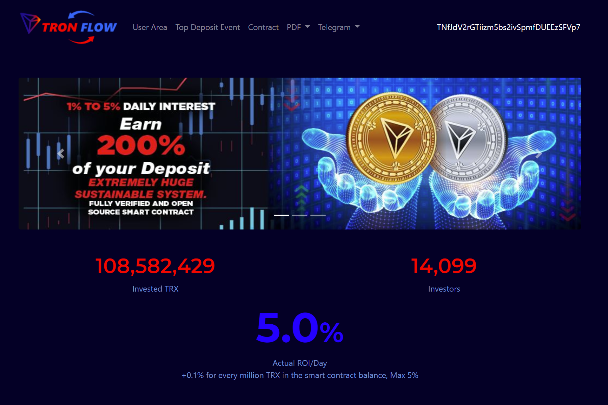

TRON FLOW 第一个自可持续的 TRON 智能合约 具有最高可持续性的众包 Tron 智能合约。 TRON FLOW 由最强大的反演系统组成

  50 TRX 最小投资
  赚取 200% 的活跃存款
  智能主动存款
  1-5% 投资回报率 x 天 - 可变投资回报率取决于余额
  4个级别（5%、3%、1%、1%）的总推荐奖金10%
  提取时，25% 会自动重新投资。
  推荐佣金转到您的活跃存款，这也将产生 200% 并在系统中创造巨大的可持续性！订阅每周回顾时事通讯，将最新趋势直接发送到您的收件箱

