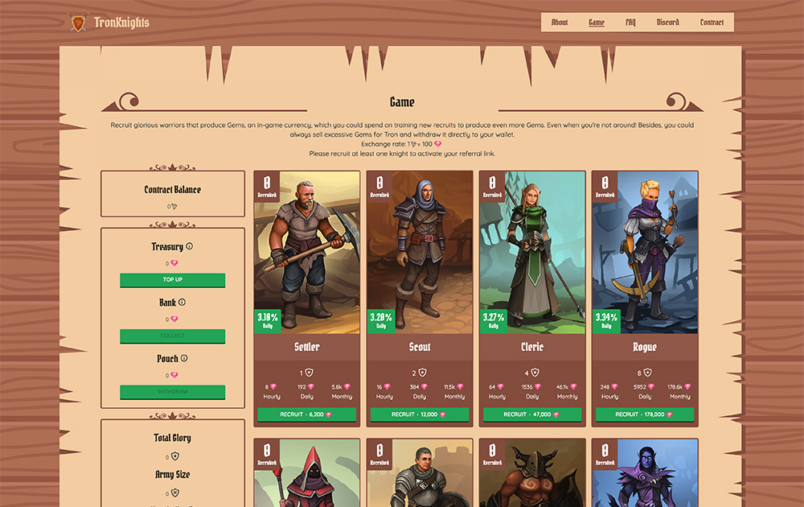

Tron Knights 是一款基于投资者的闲置游戏，您可以在其中招募和训练英勇的骑士来生产尽可能多的宝石和荣耀。建立你的军队，为 Tron 出售过多的宝石，并为更大的股息支付赚取荣耀。邀请您的朋友并获得更多宝石！我们的智能合约经过验证和审计。是时候正式向社区更新新功能的开发进度了。似乎几个月前，我们讨论了我们将添加到游戏中的 pvp、新游戏和每日任务选项。截至今天，关于每个列表项都有简洁的想法。 PVP 现在PVP…当前路线图更新：2019 年 3 月 21 日首先，作为我们的第一篇中型帖子，我们想向所有粉丝致敬，感谢他们在过去几周的不懈支持。 TronKnights 最初创建时，我们无法想象它会变得如此强大。 …

