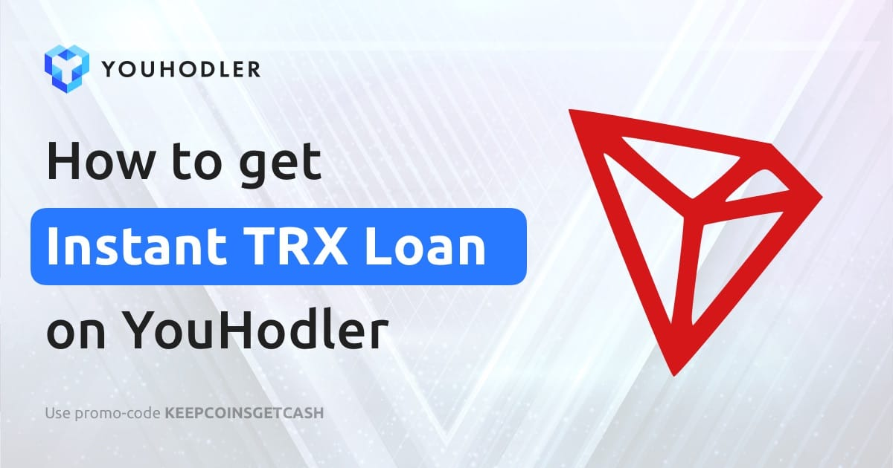

TronLoan 平台旨在实现最佳稳定性和盈利能力。对于智能合约余额中的每 500 万 TRX，系统将自动增加所有用户收益的 0.3%。因此，如果 TRX 智能合约余额为 1 亿，则将向每个成员支付 6% 的总投资。#TRON 用户现在可以从 Nexo 的首个由 $TRX 支持的法定贷款中受益。 增加 $TRX 的实用功能，缓解销售压力，并使#HODLing 无压力。领先的数字资产监管机构，第一条即时加密信用额度™ 和高收益赚取加密利息产品的先驱。

