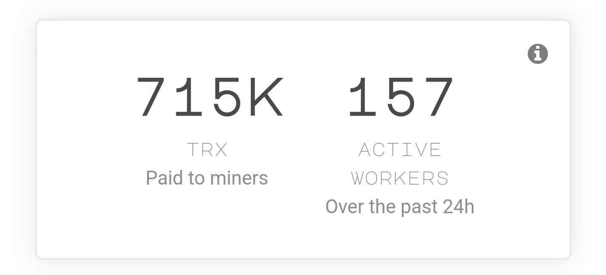

一个 Dapp，主要目标是让投资者以安全可靠的方式增加他们的 TRX。具有友好和包容的管理员的 TRX 乘数。群聊旨在成为每日空投和降雨的来源。我们刚刚推出了一个新平台！

在以下位置开采多达 40 种不可开采和可开采的加密资产
@un_mineable
！使用我们支持的挖掘算法：#ethash、#randomx 和 #x16rv2

有关支持的硬币和代币的完整列表，请访问此处：您现在会注意到一个响应速度更快（更快）的网站！我们一直在努力改进我们的平台。

未来几天会有更多更新（实时统计数据？👀），请留下来用您的 GPU 和 CPU 赚取 TRX！让我们发展社区！部分
@un_mineabl

