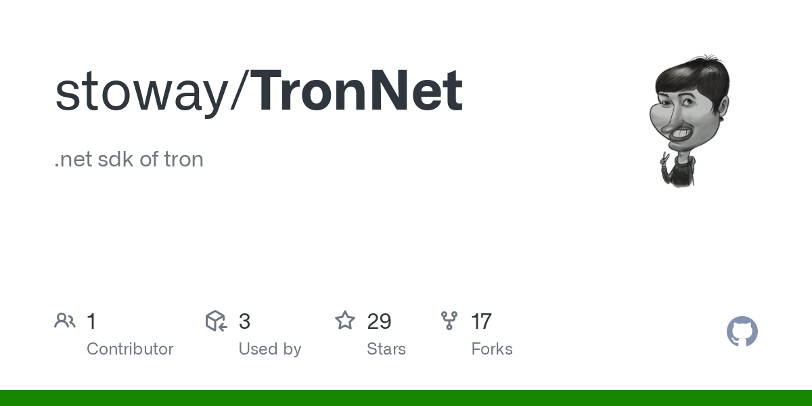

使用来自值得信赖的开发者的新验证智能合约，每天从 TRX 中赚取 20% 到 26%！ 10% 4 层推荐奖励。
26% - 6 天
24% - 8 天
22% - 11 天
20% - 15 天我们刚刚添加了#TRC20 $USDC！现在您可以在#TRON 区块链上存取 USDC。您可以混合搭配#ERC20、#TRC20 和#SPL USDC，因此即使您之前存入了ERC20，您也可以选择提取TRC20 表格。
Tron.Net.Client.NetCoreRunnerTest 一个简单的 dotnet 核心应用程序，它连接到一个本地节点，其中包含一个带有 JSON 配置的示例； Tron.Net。特隆网。使用来自值得信赖的开发者的新验证智能合约，每天从 TRX 中赚取 20% 到 26%！ 10% 4 层推荐奖励。 #10625。一般来说。

