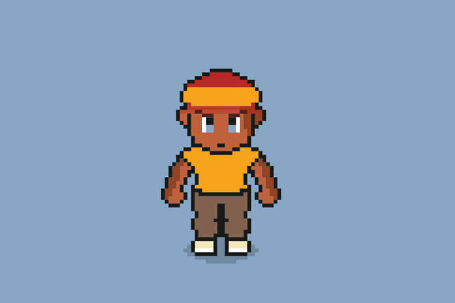

Tron Ninjas 街机复古 GameFi。一系列独特、时尚、多样的忍者，准备在 NFT 空间留下印记！ 10,000 个随机生成的各种稀有忍者作为 TRC-721 代币在 Tron 区块链上展示。
这是 Tron 上的一个 GameFi 项目，使用 P2E 机制。每个忍者都是独一无二的，并且是随机生成的，具有自己的游戏和风格属性。风格决定了 NFT 的外观，而游戏决定了玩家在游戏中将拥有的特征。我们很自豪能被认为是亚军 第二季黑客马拉松评委但我们为赢得社区投票而感到更加自豪❤️ 这对我们来说最重要。谢谢大家⭐️也非常祝贺所有其他项目

