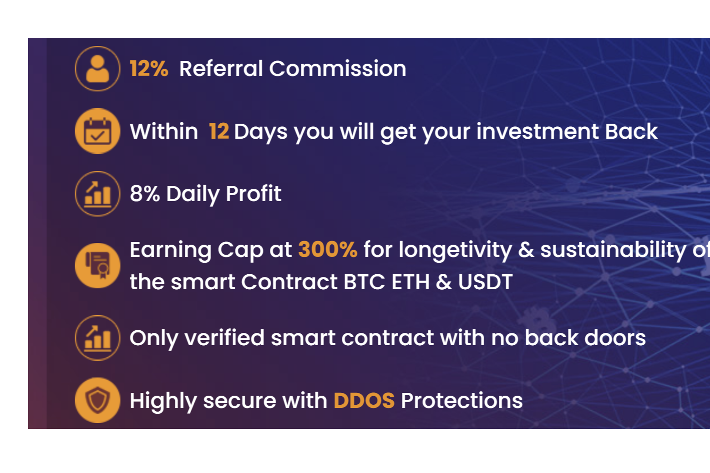

有史以来第一个接受 BTC ETH 和 ETH 的 Tron 智能合约USDT
8% 每日利润
12% 推荐佣金
在 12 天内，您将获得您的投资回报
长寿和 300% 的收入上限智能合约的可持续性
完全验证的智能合约有史以来第一个接受 BTC ETH 和 USDT 的 Tron 智能合约 8% 每日利润 12% 推荐佣金 在 12 天内您将获得您的投资回报。您可以通过使用投票系统参与 Tron 网络来赚取被动收入。 Tron 目前的年收益率约为 5%，减去 Super ...Tron、Gnox 和 Cronos 等 Defi 加密资产已成为看跌加密市场的强大投资形式。

