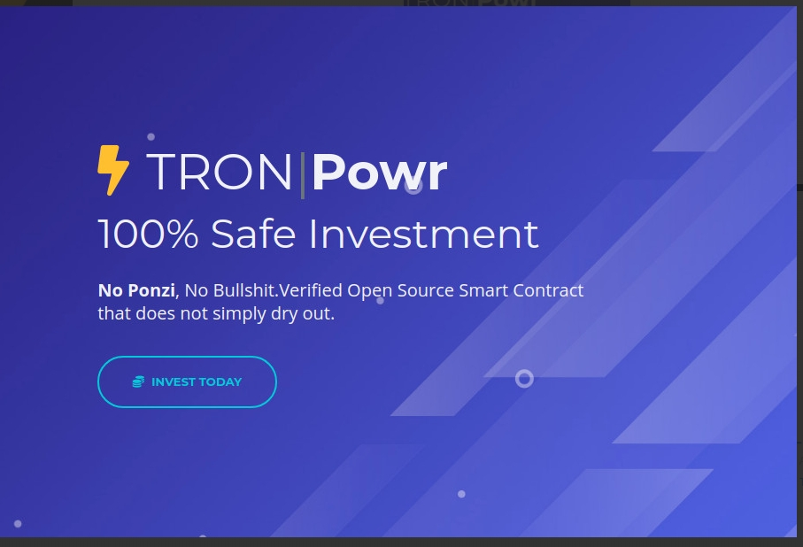

Uniqueinvestment 智能合约不会因为基于合约余额的 POWR 价格和智能限制而干涸。*TRON*是一个雄心勃勃的项目，致力于为真正去中心化的互联网构建基础设施。*TRON*协议，最大的区块链之一...TRON*是一个分散的、基于开源区块链的操作系统，具有智能合约功能、权益证明原则作为其共识......*Tron是一个基于区块链的去中心化数字平台，拥有自己的加密货币，称为 Tronix 或 TRX。由新加坡非营利组织于 2017 年创立...

