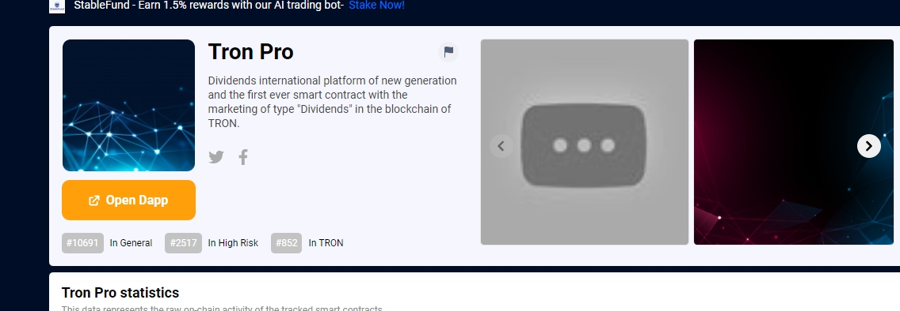

它是一个对所有用户 100% 透明和公平的开源 ROI 平台。 Tron 区块链上的 tron 区块链上的 100% 去中心化智能联系。请考虑只投资您可以承受损失的TRX。您所要做的就是存入和再投资或提取您的利润。您将每秒获得利润，直到合约中没有钱为止。投资更多TRX以获得更多利润。您可以向人们推荐此智能合约并赚取最多 4 个级别的推荐佣金。最低：50 TRX新一代红利国际平台，第一个在波场区块链中以“红利”类型营销的智能合约。

