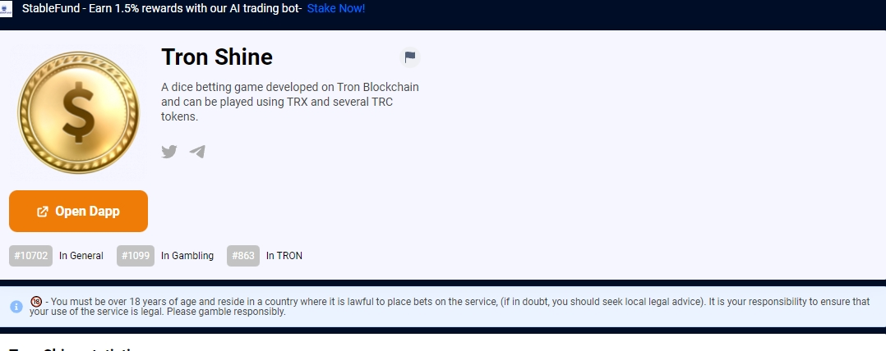

一款基于 Tron 区块链开发的骰子投注游戏，可以使用 TRX 和多个 TRC 代币进行游戏。&nbsp;
Frozen SHINE持有者将每天分享TRX产生的游戏收益的70%和每周上市所有代币产生的游戏收益的50%。SHINE代币只能通过TRX投注挖矿。您还可以使用列出的代币进行投注并增加您的资产规模（禁止挖掘代币）零 SHINE 代币已为团队和所有者预先铸造，如果不为所有人下注，就无法获得 SHINE。一款基于*Tron*区块链开发的骰子投注游戏，可以使用 TRX 和多个 TRC 代币进行游戏。《冰雪奇缘》*持有者*将分享游戏利润的70%...

