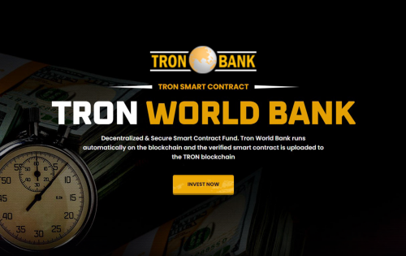

去中心化和安全的智能合约基金。 波场世界银行在区块链上自动运行，经过验证的智能合约上传到波场区块链
Tron 世界银行智能合约为所有投资者每天产生 3.3% 至 7.7% 的利润。 智能合约是完全自主的、自动化的并且不受外部影响。 Tron World Bank 是在短短几天内增加资产的最简单方法。

正如您可能已经猜到的那样，Tron World Bank 是一个基于 TRON 区块链的项目。 Tron World Bank 允许您向 dApp 投资，并随着时间的推移赚取利息。 投资回报率最高可达 297%。 Tron World Bank 使用智能合约技术，完全去中心化。 也有一个会员计划可供您查看。

