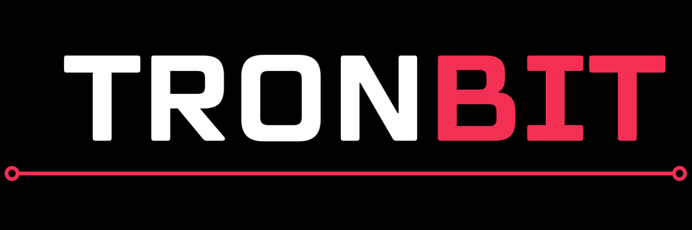

我们只会向您收取一定的费用，用于投资数字货币交易，并将退还给项目。

购买BTC或ETH。

我们将在Coinbase开始购买。如果你还没有一些BTC或ETH交易TRX，你需要得到一些。 Coinbase是最容易购买BTC和ETH的地...

如果您已经拥有Coinbase帐户，您只需登录并购买尽可能多的BTC或ETH，就像您想要交换Tron一样。专业提示：请记住增加一点来支付交易...

在主要的加密货币交易所开立账户。

接下来，您需要在交易所开立账户，您可以在TRX卖出BTC或ETH。有几个地方你可以做到这一点，包括Binance，Bitfinex，Bitt...

