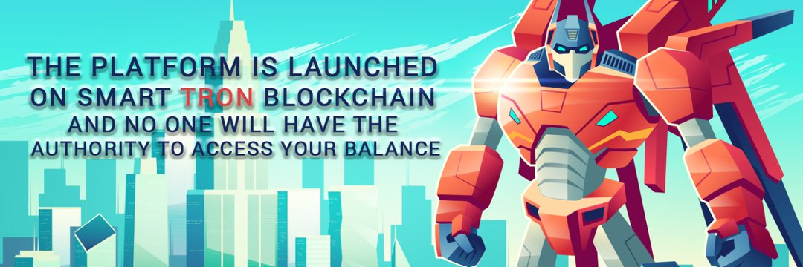

该平台正在开发 Tron 智能合约网络区块链，每日 TRX 分红购买机器人每月获得 102% - 111%！ 这个平台的七级推荐系统，在一级向您支付 6.5% 的佣金，二级 2%，三级 0.5%，四级 0.3%，五级 0.2%，六级 0.1% 和七级 0.1%。

如何开始使用 Tron 钱包并购买机器人？
http://youtu.be/r3kgR9ZbGHw

如何获得免费交易 Tron 带宽和能量？
http://youtu.be/V6NzQs_Bd0I

如何解锁级别或步骤推荐系统？
http://youtu.be/_ndi9n9Q4ec

如何计算机器人红利？
http://youtu.be/8xBtJqLYsy8

