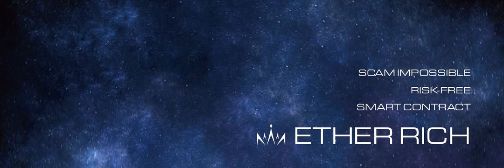

Tron Camp 是一个点对点融资的 Dapp（去中心化应用程序），可以赚取 10% 的 Odyssey 和 15% 的 Apollo，就像在太空旅行一样。 这是一个去中心化的计划，专注于通过一种任何人都可以轻松参与的名为太空旅行的有趣材料来实现更快的利润。由于网站上使用了 Google API，中国用户无法参与。
Etherrich 网站开发团队正在尽最大努力解决这个问题。
中国用户，请稍等！
目前 http://dapp.com 排名第 59 位！
感谢韩国队。

