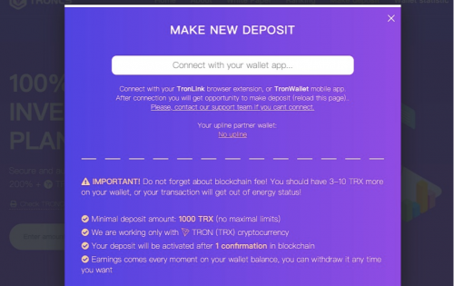

---
title: "TRONCS WORLD"
description: "Troncs是一个基于TRX公链的投资平台。 我们使用公链网络技术设立了由独立审计公司运行的代码审计"
date: 2022-08-21T00:00:00+08:00
lastmod: 2022-08-21T00:00:00+08:00
draft: false
authors: ["boogArno"]
featuredImage: "troncs-world.png"
tags: ["High risk","TRONCS WORLD"]
categories: ["nfts"]
nfts: ["High risk"]
blockchain: "TRON"
website: "https://dappradar.com/"
twitter: ""
discord: ""
telegram: ""
github: ""
youtube: ""
twitch: ""
facebook: ""
instagram: ""
reddit: ""
medium: ""
steam: ""
gitbook: ""
googleplay: ""
appstore: ""
status: "Live"
weight: 
lightgallery: true
toc: true
pinned: false
recommend: false
recommend1: false
---
波场共识（TRONCS）是基于TRX公链的投资平台。我们使用公链网络技术，设置了由独立审计公司运行的代码审计。社区成员之间分配奖励的功能可以在一定条件下执行。我们使用革命性的去中心化智能合约技术，让数字资产的金融流动按照程序代码进行处理和分配。所有流程都在基于 TRX 加密货币的开放去中心化区块链网络中进行，零风险 TRONCS 开发人员在 Tron 区块链上部署永久自执行智能合约，任何实体都无法修改。透明度和匿名性 智能合约是公开的。任何人都可以看到代码和整个交易。这确保了系统和真实项目统计数据的完整性。 100% 安全投资    智能合约技术确保所有参与者资金的完全安全。没有人可以偷钱或更改智能合约

