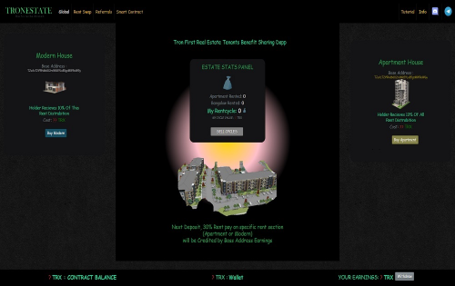

Tronestate 是 tron 上同类首个租金红利分享 dapp，用户租用公寓或现代房屋或两者兼有（租金数量不限），并从每所支付租金的房屋中获得红利。 当您租房时，您成为老板，在特定房屋（现代或公寓）的已付租金上获得 30% 的即时股息（老板股息）。现代住宅租户分享现代住宅租金支付租金的 10%，而公寓租户分享 13% 在公寓和现代的已付租金上。每间出租房屋都会产生可用于 tron 的 Rentcyle。 每次支付租金时，价格上涨 3%。

