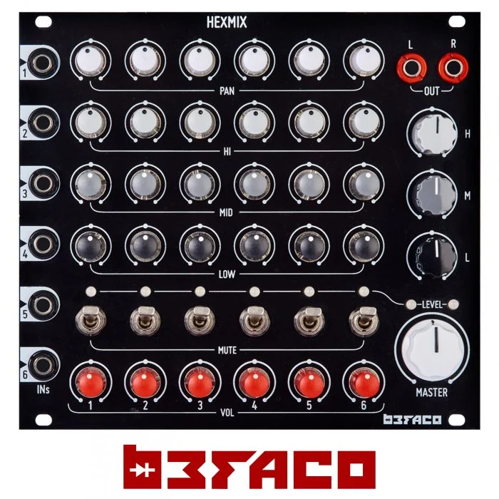

TronEx50K 是 Tron 区块链上的智能合约。 它使您可以赚取 50 倍的投资收益。 它是可验证和透明的。 也就是说，您可以轻松访问它并亲自查看。

TronEx50K DAPP技术分析
TronEx50K dApp 是基于 Tron 协议构建的高风险类别的加密资产。 现在，根据用户数量，它在一般 dApp 排名中排名第 3837 位，在高风险类别中排名第 1835 位，这让您可以很好地了解 TronEx50K dApp 在其竞争对手中的表现。

通过分析过去 30 天窗口中的 TronEx50K dApp 数据，很明显 dApp 的余额为 0.00 美元，交易量稳定在 0.00 美元。 TronEx50K 在 30 天内产生了 0 笔交易，变化为 0%。 显然，与之前的 7 天期间相比，交易量稳定了 0%。 过去 7 天的数据显示，TronEx50K 用户基数为 0，稳定了 0%。

