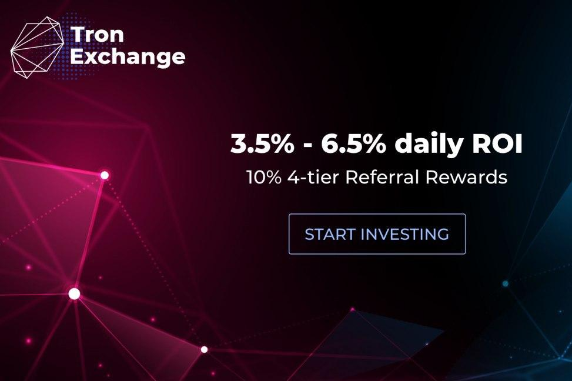

TronExchange 基于在 TRON (TRX) 区块链中实施的智能合约。 100% 确保透明度，因为它位于分布式网络中，其中交易记录在多个位置。

Tron 是一个基于区块链的开源去中心化内容娱乐协议。 波场致力于利用区块链和分布式存储技术构建全球免费内容娱乐系统。 用户以去中心化的内容自治形式自由发布、存储和拥有数据，分发、订阅和推送由数字资产的发行、流通和交易方式驱动，赋能内容创作者和去中心化的娱乐内容教育生态系统。

