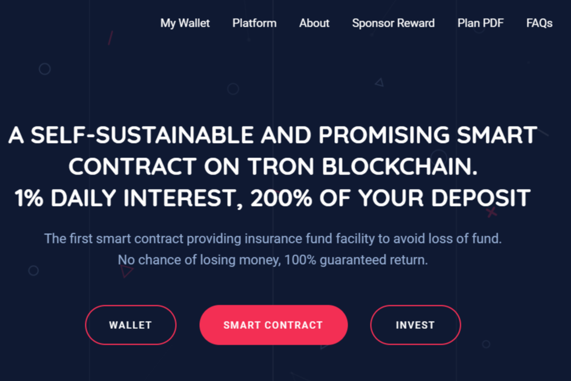

什么是 TronFace？
TRON 区块链上的一个自我可持续和有前途的智能合约。
1% 每日利息，200% 您的存款
第一个提供保险基金设施以避免资金损失的智能合约。 没有赔钱的机会，100%保证回报。

TronFace 是一个自我可持续的投资平台。 它是 100% 去中心化的。 TronFace 提供保险基金工具以防止资金损失。 它声称是无风险的。 它基于 TRON 区块链。

TronFace dApp 是一种基于 Tron 协议的高风险类别的加密资产。 现在，根据用户数量，它在一般 dApp 排名中排名第 8142 位，在高风险类别中排名第 1687 位，这让您可以很好地了解 TronFace dApp 在其竞争对手中的表现。

