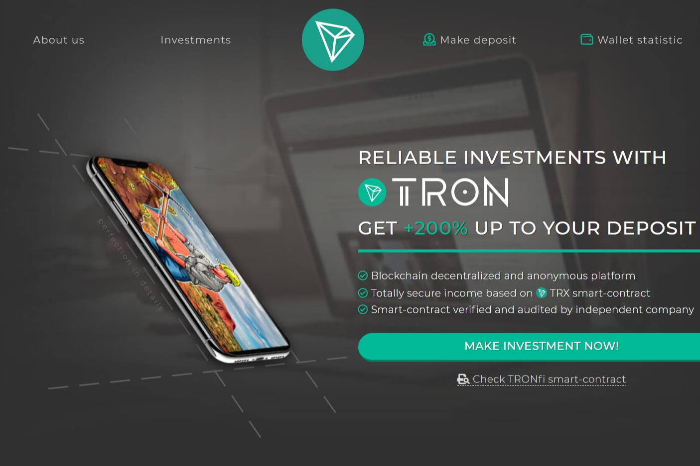

我们根据基本利率、智能合约总余额红利和个人“持有红利”提供百分比增长的投资条件。 最大可用利润：每笔存款+200% 无限收益，利率始终在增长。
智能合约技术确保所有参与者资金的完全安全。 没有人可以窃取资金或更改合约功能。TRX 智能合约的可靠性。 骗局是不可能的！

ronFi 旨在建立一个包罗万象的 DeFi、DAO 生态，通过了第三方安全审核的首个 Tron 项目。一切本着 YFI 精神：没有预挖，没有创始人股份，不涉及风险投资的利益。

