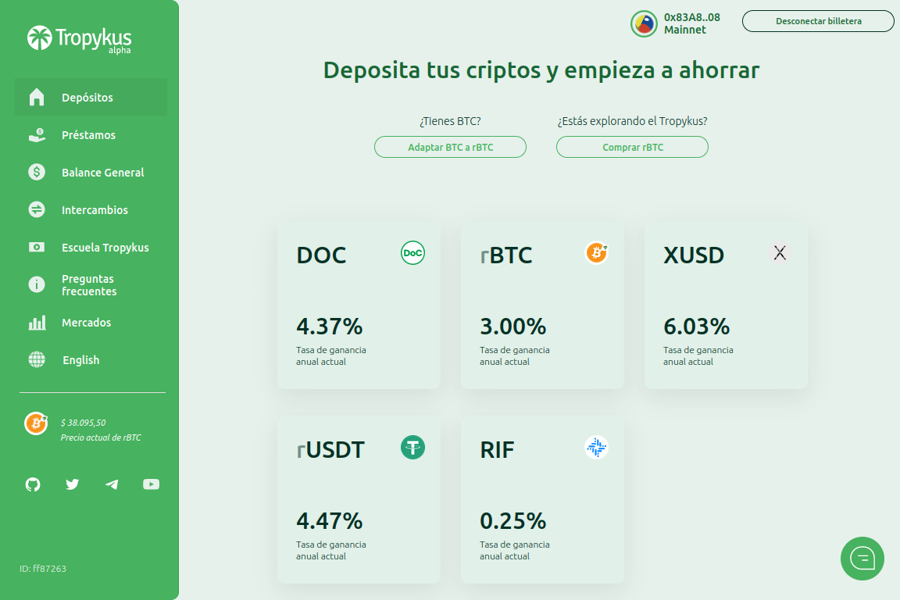

Tropykus 是面向比特币的 DeFi 平台，旨在帮助拉丁美洲人节省更多资金并获得更公平的贷款。 它建立在 RSK（比特币的第二层）之上，用户可以使用以下货币保存和获得贷款：rBTC、DOC、XUSD、rUSDT 和 RIF。

Tropykus 是一种借贷协议，旨在为普通人带来去中心化金融的优势。 比您的银行更高的收益率，并且您的资金始终可用 每年获得 3% 的比特币和超过 4% 的数字美元。

我们是特罗皮库斯！ #ReFi

节省数字美元和#Bitcoin。

在拉丁美洲申请 100% 灵活贷款。

