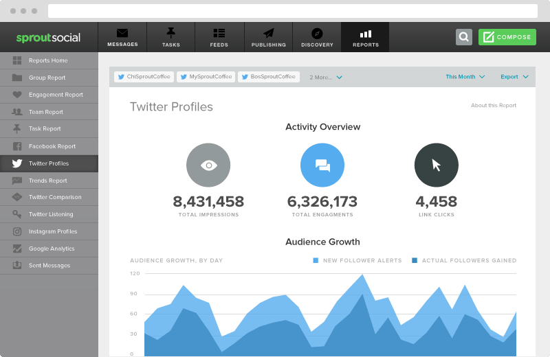

TweetN 是一个 Defi 协议，旨在结合两大行业：广告和区块链。 用户可以通过发布推文来赚钱。 在我们的 Dapp 上使用我们的键盘 NFT 赚取 $TweetN。

TweetN Dashboard — 一种 Defi 协议，旨在将两大行业结合在一起：广告和区块链。 用户可以通过发推文来赚钱。 使用 NFT 键盘赚取 $TweetN。 TweetN Dashboard 的核心有两位创始人，其中包括一位以英语为母语的人和一位沟通培训专家。

TweetN Dashboard 是一个协议，旨在将两个主要行业结合在一起：广告和区块链。 该平台运行在 BNB Chain 区块链上。 × 你快到了！ 请验证您的帐户。 验证链接已发送到您的电子邮件地址。

