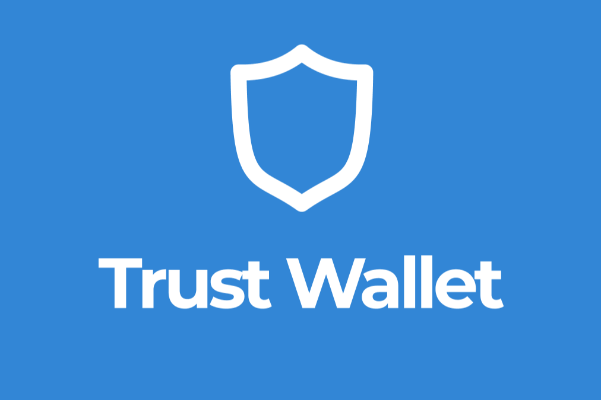

---
title: "🤹🎮小游戏🎮🤹‍♂️🔸玩的越多，注入的算力越多，赚的钱就越多👍验证合约。 每个人都可以检查它并"
description: "🤹🎮小游戏🎮🤹‍♂️
🔸 玩的越多，注入的算力越多，赚的钱就越多

👍经过验证的合同。 每个人都可以检查它并"
date: 2022-08-21T00:00:00+08:00
lastmod: 2022-08-21T00:00:00+08:00
draft: false
authors: ["boogArno"]
featuredImage: "twt-miner.png"
tags: ["High risk","TWT Miner"]
categories: ["nfts"]
nfts: ["High risk"]
blockchain: "BSC"
website: "https://twtminer.com/"
twitter: "https://twitter.com/tokentrustbnb"
discord: ""
telegram: "https://t.me/trustwalletminer_official"
github: ""
youtube: ""
twitch: ""
facebook: "https://www.facebook.com/groups/395836615407926"
instagram: ""
reddit: "https://www.reddit.com/user/TrustWalletToken"
medium: "https://medium.com/@TrustWalletToken"
steam: ""
gitbook: ""
googleplay: ""
appstore: ""
status: "Live"
weight: 
lightgallery: true
toc: true
pinned: false
recommend: false
recommend1: false
---
Trust Wallet Token 是 BEP-20 标准的代币，基于币安智能链区块链。 最初，该代币是作为 Trust Wallet 钱包的内部代币创建的，但现在它已经相当普遍并在加密货币交易所进行交易

超过 25% 的 TWT 代币已经通过促销、赠品或用户参与活动在 Trust Wallet 社区中分发。

TT-Miner是KawPow、PROGPOW、ETHASH、ETCHASH、UBQHASH和MTP等算法的矿工。 TT-Miner 还支持 Nicehash Ethash 挖矿。 它适用于 Windows 和 Linux。 显卡仅受 Nvidia 支持。

开发人员费用 - DevFee 是 1 分钟挖矿 1 小时 - 大约 1.7%，相当高。 相比之下，PhoenixMiner 的开发者佣金为 0.65%。

