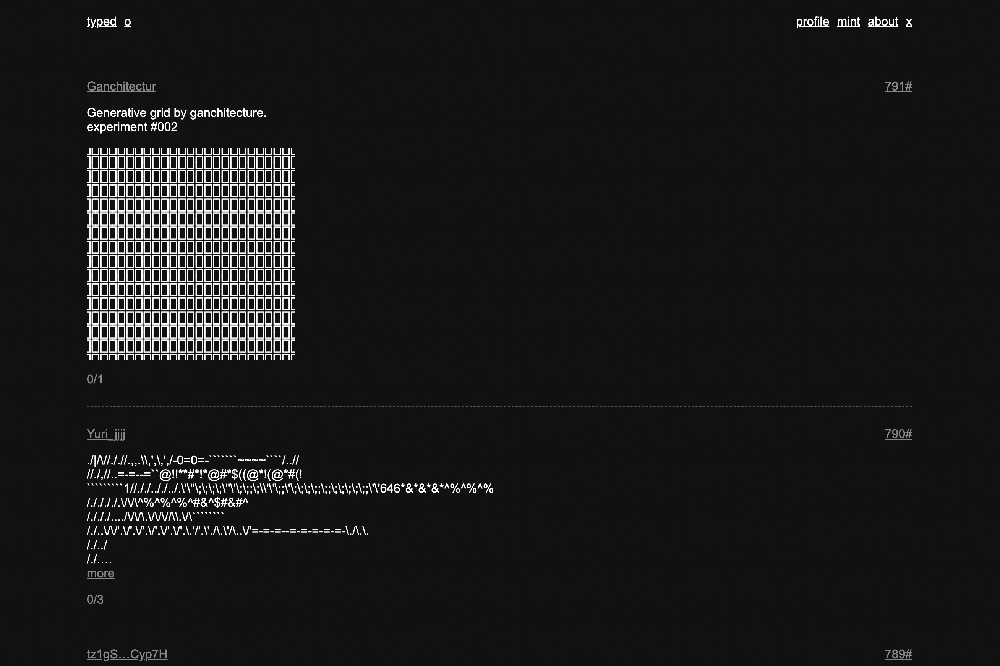

tezos 区块链上基于文本的 nft 市场

1. 许多具有共同特征或特征的人或事物将它们区分为一个群体或类别：这种类型的汽车在 1970 年代很流行。 请参阅 kind 的同义词。
2.
一个。 具有群体或阶级特征的人或物：他是那种注定要惹上麻烦的人。
湾。 具有群体或类别的理想特征的示例或模型； 一个体现：“他是完美的军事花花公子”（乔伊斯·卡里）。
C。 被视为代表特定职业、等级或社会群体的人：一群高管类型； 旅游类型经常光顾的餐厅。
2. 