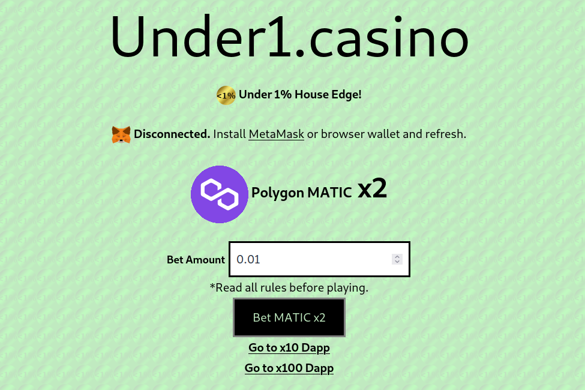

Under1.casino
低于 1% 的房屋优势！
当房子保持较少时，您会赢得更多！
将这些赔率与任何其他 Dapp 或任何赌场游戏进行比较！
具有 x2、x10 和 x100 游戏。
每次下注都有可能获胜。
合同源代码已验证。
与 MetaMask 或浏览器钱包兼容。
您可以通过直接发送到合约地址来玩。
详情见网站。

低于 1% 的房屋优势！ 当房子保持较少时，您会赢得更多！ 每次下注都有可能获胜。 使用 MetaMask 或直接发送到合约地址玩。 在此处阅读完整的详细信息。 *规则：必须下注超过用于下注的气体量。 您的第一次下注购买了一张价值您下注金额的彩票。 您的下一个赌注购买另一张票并检查前一张。

