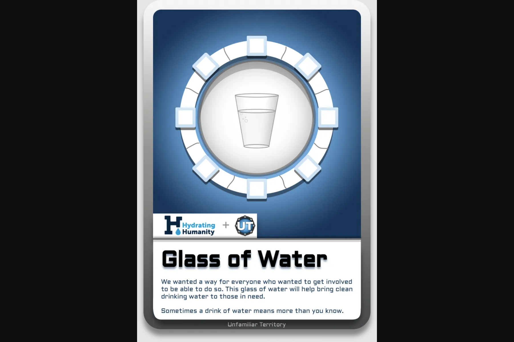

The Well是Unfamiliar Territory世界的中心。
每个 Well NFT 都会解锁游戏中的 Well *，并通过与 Hydrating Humanity 的合作资助在东非建造一口真正的水井。

创始人卡每张创始人卡都与陌生领土的叙述联系在一起。 随着游戏的开发，创始人卡为持有者提供了特殊的优势。 购买Founders Cards社区加入构成Unfamiliar Territory生命源的强大社区。 具有相似兴趣的人的积极和安全的聚会。

陌生的领土有点像乔治·格什温的《一个美国人在巴黎》的黑色电影。 也就是说，这篇文章是“程序化的”，因为它试图讲述一个关于另一个国家的美国游客的短篇故事。 然而，对于这个外国人来说，冒险不是发生在巴黎繁华的城市街道上，而是发生在边境以南的某个地方，那里的当地语言美丽而疏离，风景迷人但令人迷惑。

