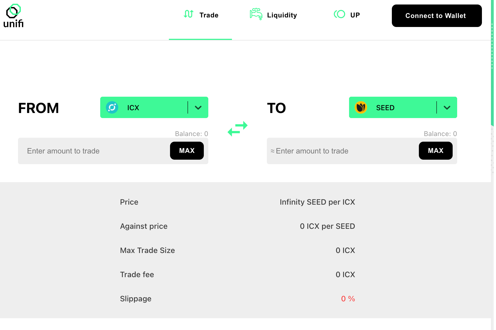

Unifi Protocol DAO 是一组非托管、可互操作、去中心化和多链的智能合约，为下一代 DeFi 开发提供构建模块。 Unifi 协议旨在为开发人员提供功能性的 DeFi 构建块，将多个区块链连接到一个大型 DeFi 市场。 uTrade 是利用多链和多平台流动性挖掘为 Unifi 的全球治理代币 UNFI 提供动力的概念验证。
UNFI 代币融合了开发团队的代币经济学和具有代表性的区块链治理专业知识，这些知识是通过多个顶级区块链上的操作节点获得的。 UNFI 高回报的股权证明全球治理模型推动了整个社区的形成，这些社区受到激励，以倡导 UNFI 尽可能成功。

