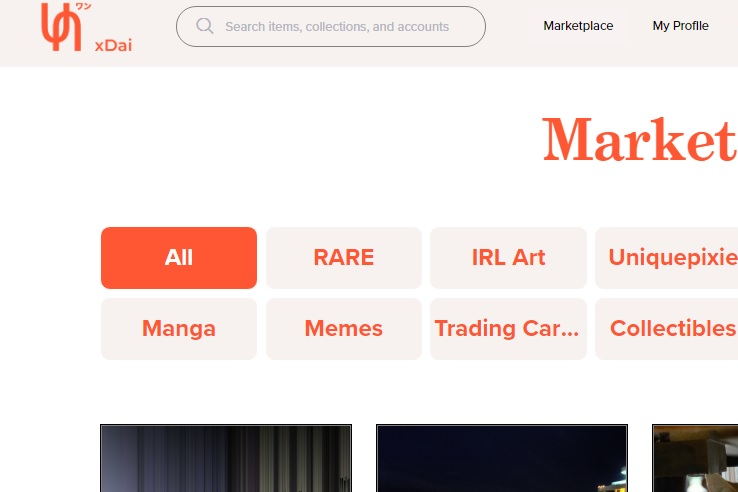

现在也在xDai上！
什么是Unique.One？
Unique.One 渴望成为一个真正去中心化的数字艺术市场，支持艺术家而不是从他们身上获利。我们是非营利性的，并有净零费用政策。我们相信支持艺术家，并且不会向艺术家收取创作作品的费用。
Unique.One 的最终目标是创建一个由数字艺术社区独立运营的充满活力的真正去中心化市场，这将为新的专业艺术家提供一个社交场所，并在公平和公平的竞争环境中将他们的创造力推向极限。
Unique 将由 DAO 管理，以实现真正的去中心化。在第一阶段，我们将通过快照收集社区投票。目前，我们已经批准了 Unique One DAO 治理提案。所有代币持有者都可以在governance.unique.one 投票
你想解决什么问题？
我们看到，大多数 NFT 艺术市场都是作为企业而非社区运营的。他们还向艺术家收取费用并收取大额平台费用。其他人则对新艺术家不那么开放，更像是一家传统艺术画廊。我们也有很多审查和禁令，因为平台的管理员喜欢它，这是没有理由的。我们认为这是最糟糕的组合，独裁和公司。 Unique One 是纯粹的社区运营平台能够成功的纯粹回应。
代币分配
开发基金 - 20% DAO 分配 - 20% 创造挖矿 - 10% 交易挖矿 - 10% 批量挖矿 - 10% 竞赛奖励 - 10% LP 挖矿 - 10% 赏金 - 5% 空投 - 5%

