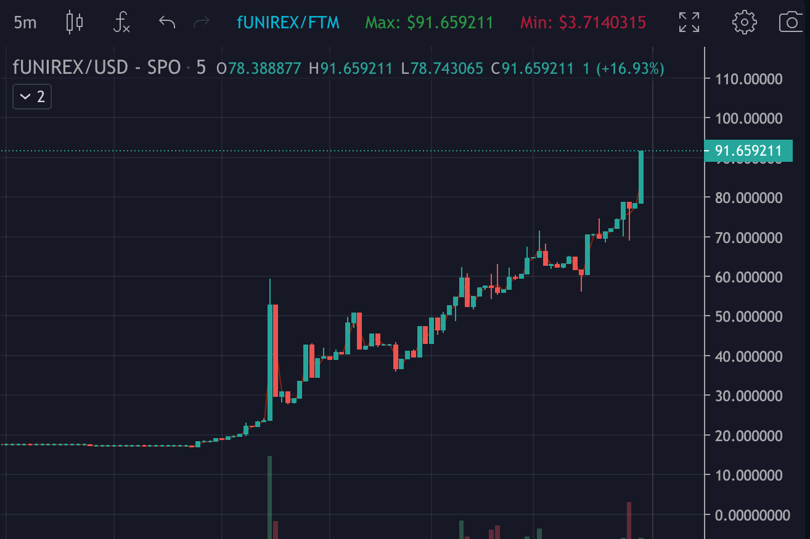

Unirex Finance 是一个去中心化的农场收益项目，在 Fantom Chain、Polygon（很快）和 BSC（很快）上运行。
Unirex Finance 将提供以下服务：

  Yield Farm：通过质押流动性池代币赚取 fUNIREX 代币。
  Auto fUNIREX（很快）：自动复合您的 Unirex 质押，如此惊人的功能。
  UNIREX 股票（即将推出）：质押您的 fUNIREX 并赚取 FTM、USDC、MATIC、BTC、ETH 等代币。
  最多 15,600 个 UNIREX 代币
  0.01 排放率请访问 API 自助结账部分，选择最适合您的计划并按照相应的步骤进行操作。

