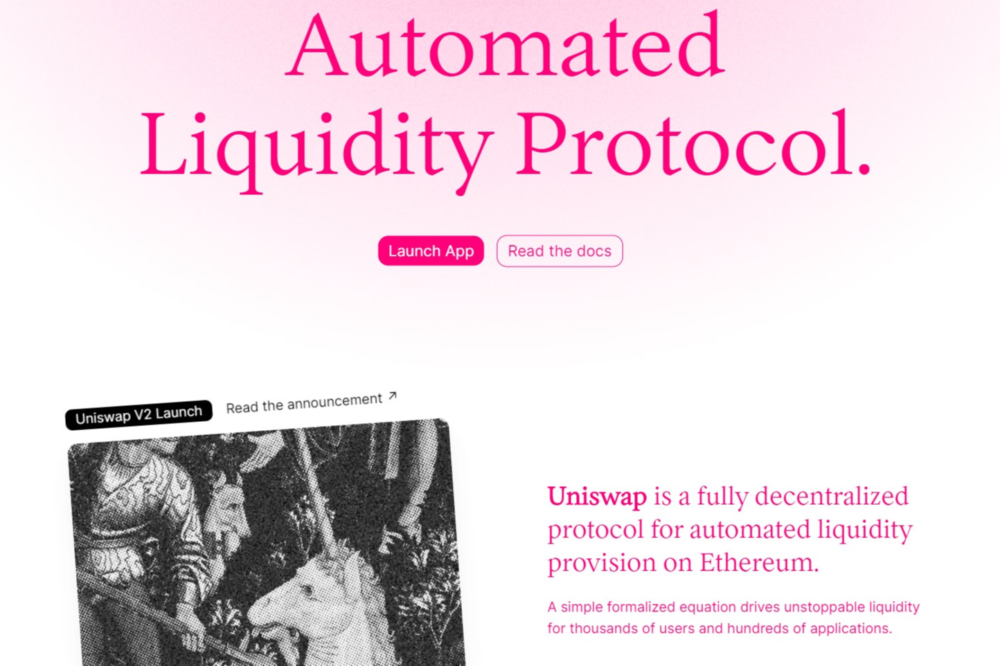

Uniswap 是一种在以太坊上交换 ERC-20 代币的协议。它消除了受信任的中介机构和不必要的租金提取形式，从而实现了快速、高效的交易。它在哪里权衡权力下放，审查阻力和安全性是优先考虑的。在 Uniswap v3 中，LP 可以**将他们的资金集中在自定义价格范围内，以期望的价格提供更多的流动性。**Uniswap v2 要求所有用户在从 0 到无穷大的整个价格曲线上提供流动性，而 Uniswap v3 允许流动性提供者 (LP) 选择性地将资金集中在他们认为会产生最高回报的价格范围内。

