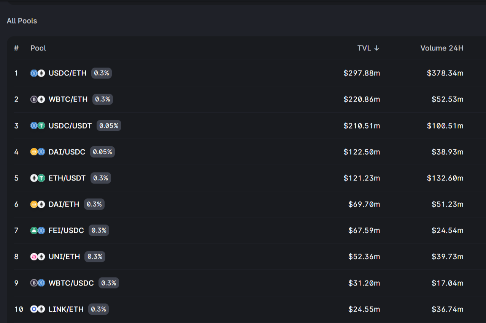

Uniswap v3 介绍：

  集中流动性，让个别 LP 精细控制其资金分配到的价格范围。单个头寸汇总到一个池中，形成一条组合曲线供用户交易
  多重收费等级，允许有限合伙人因承担不同程度的风险而获得适当补偿

这些特性使 Uniswap v3 成为有史以来设计的最灵活、最高效的 AMM：

  相对于 Uniswap v2，LP 可以提供高达 4000 倍资本效率的流动性，从而获得更高的资本回报
  资本效率为可以超越中心化交易所和以稳定币为重点的 AMM 的低滑点交易执行铺平了道路
  有限合伙人可以显着增加他们对首选资产的敞口并降低他们的下行风险
  有限合伙人可以通过在完全高于或低于市场价格的价格范围内增加流动性来将一种资产出售给另一种资产，近似于沿着平滑曲线执行的收费限价单

