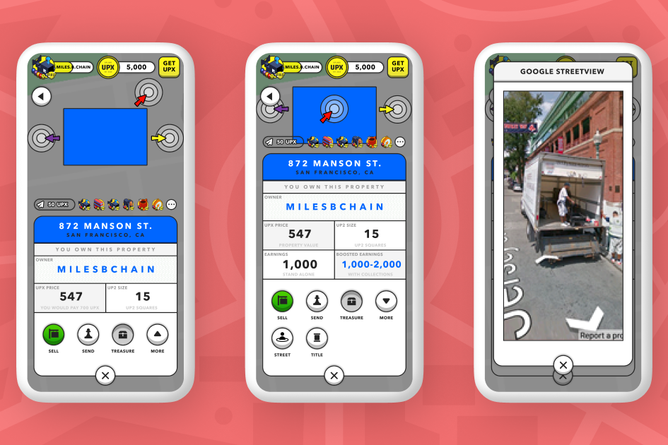

Upland 是领先的基于现实世界的区块链元宇宙，它将赚取 NFT 和持有法定价值的数字财产的快感与游戏探索和结识其他玩家的乐趣结合在一起。在高度可持续的 EOS 区块链的支持下，Upland 已被公认为 Fast Company 的 Next Big Things in Tech 之一，因为该平台基于社区的商业，玩家和企业定义了游戏、收入和连接。 Upland 可在 iOS、Android 和浏览器上使用，它抓住了 Web 3.0 技术的潜力，其中基于现实世界地址和历史地标的虚拟财产成为将数字社区与现实世界相结合的游戏化活动中心。

