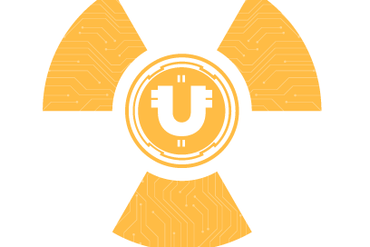

通过 Uranium Financial Auto-Staking Protocol（简称 URFP），我们将带领 Uranium 引领 DeFi 3.0 的一场革命。 Uranium 使 Staking 变得更容易、更高效，并为 $URF 代币持有者提供了加密货币中最强劲的稳定回报。只需通过一个简单的买入持有赚取系统，在您的钱包中持有 $URF 并将奖励直接进入您的钱包。Uranium Financial 在前 12 个月的支出为 1,821,183.05%，可与迄今为止 DeFi 领域的任何公司相媲美。前 12 个月后，利率在预定义的长期利率周期内下降。

