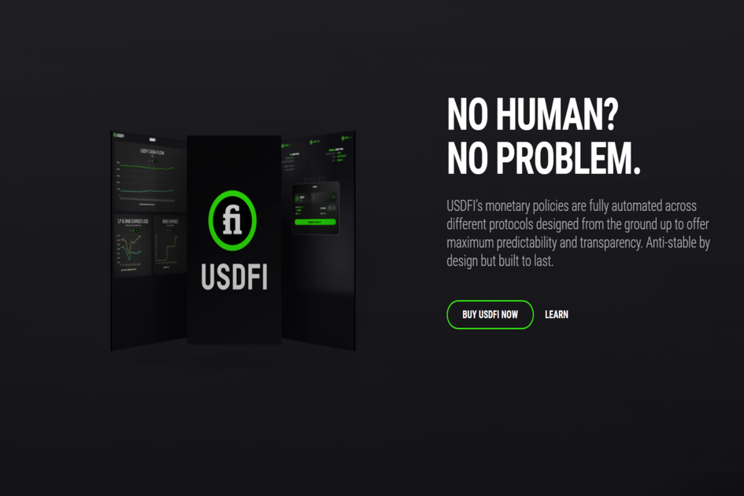

USDFI 是一种去中心化的稳定币协议，适用于具有以太坊虚拟机兼容性的任何区块链。 USDFI 稳定币是非托管的，并由其生态系统的收入作为抵押，该生态系统由协议拥有的链上金库组成，具有储备证明和自动化做市商操作。作为低时间偏好设计的一个组成部分，在中短期内，预​​计 USDFI 将经历重大但短暂的价格不稳定和有限的用户信心。但是，该协议设计包含缓冲并具有几个关键的稳定性机制，并充当 USDFI 的最后手段的买方和自动做市商。该协议的收入将自动以更高的价格无限回购 USDFI，直到价格稳定恢复。随着时间的推移，用户信心和稳定机制之间的相互依赖将推动价格均衡，并为 USDFI 保持最大的价格稳定性。该设计对可扩展性没有限制。

