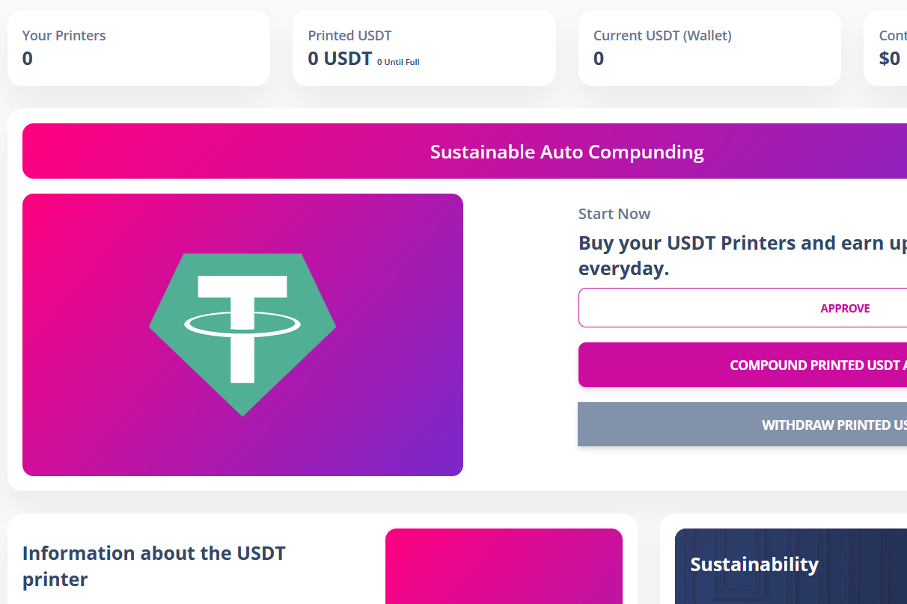

Money Printer Finance 是一个免费且不可变的开源智能合约USDT 打印机按当前打印效率每天支付 10%。随着您和其他玩家购买打印机、再投资打印的 UDST 和提取 USDT，挖矿效率会上升和下降。
游戏的目标是重新投资以比其他玩家更快、更频繁地购买更多打印机。这反过来又可以更快地为您赚取更多的 USDT。使用您的每日 USDT 收入购买更多打印机将在 30 天或更短的时间内使您的打印机增加 4 倍。

