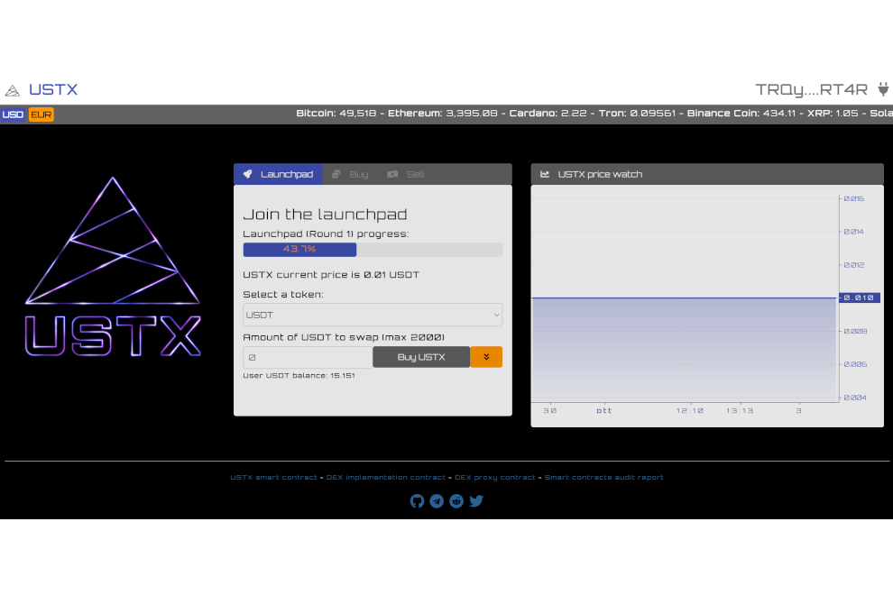

该项目围绕两个支柱构建：USTX 代币和 DEX。该代币是 TRC20 合约，部署在 Tron 区块链上，实现了所需的功能，以非常低的费用实现简单的交易。 DEX 是项目的核心。 DEX 允许将 USTX 与主要稳定币进行交易：USDT、USDC、USDJ 和 TUSD。智能合约主动管理 USTX/稳定币对上的所有交易所交易，目标是与代币的流通市值相比，将内部稳定币储备保持在一定水平。如果储备高于目标水平，则系统允许在市场上涨趋势期间扩大价格，并在下跌趋势期间抑制价格下跌，从而减少波动性。如果储备低于所需水平，系统会降低膨胀和阻尼效应，以恢复储备水平。所有这些都在链上进行管理，无需合约所有者的干预。稳定币储备永远锁定在 DEX 合约中，任何用户都可以在链上进行验证。这为 USTX 代币提供了内在价值。作为多资产，储备保证了弹性。此外，由于价格行为不是基于预言机，因此在稳定币价格波动的情况下，它不会受到雪崩效应的影响。智能合约经过审计和开源。

