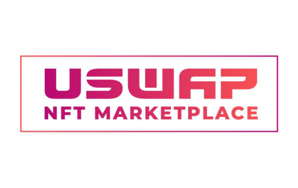

Uswap NFT 市场被设计为一个去中心化的公共市场，可以简单地在 TRON 上铸造、交易和收集 NFT。
UNM 允许艺术家铸造 NFT 的新作品并进行出售/拍卖。
拥有 Tpunks、BAYCTron、CoolCatsTron、tronmeebits 等现有 NFT 资产的收藏家可以将这些现有 NFT 资产导入 UNM 并出售。希望购买 NFT 的收藏家可以浏览多个收藏品和个人艺术品，以找到他们最喜欢的项目/作品。本部分是为初学者加密投资者创建的。亲爱的朋友，我们尽最大努力让您更轻松地迈出加密投资世界的第一步。
去 https.ntf.uswap.me 浏览。

