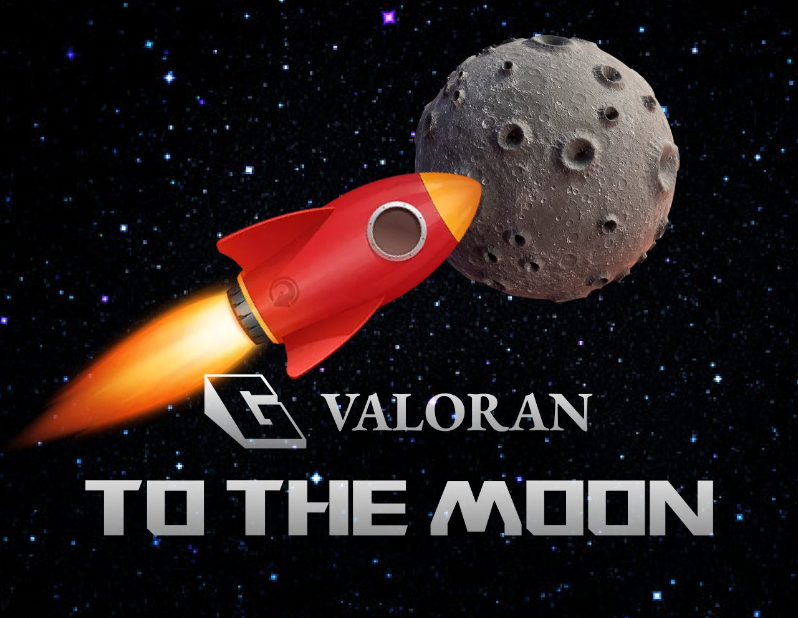

游戏背景
在多维宇宙中，有一块虚空之地，名为瓦罗兰。这片大陆，山高谷深，宝物数不胜数。但哪里有宝藏，哪里就有危险。这些宝物多年来一直被怪物守护着，普通人极难接近。由于宝物带来了巨大的财富和名声，无数英雄涌入瓦罗兰大陆。任务、冒险和战斗永无止境。
游戏玩法
玩游戏时，玩家可以挑战各种副本，升级英雄，获得更好的道具。游戏的最终目标是击败BOSS——幻灵兽。所有玩家在游戏中支付的代币会自动进入幻灵兽的体内，如果被英雄击败则会释放所有代币。击败后，幻影兽将重生，变得更加强大，不断在其体内积累资产，等待玩家再次挑战它。

