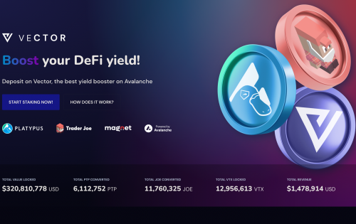

Alpha Homora 是在以太坊主网上推出的杠杆收益农业和杠杆流动性提供协议。
ETH 贷方可以在 ETH 上赚取高额利息。贷款利率来自杠杆收益农民/流动性提供者借入这些 ETH 来收益农场/提供流动性。
单产农民可以通过承担杠杆单产农业头寸获得更高的农业 APY 和交易费用 APY。通过杠杆作用，Alpha Homora 将代表用户借用 ETH 来产生农场。
流动性提供者可以通过承担杠杆流动性提供头寸获得更高的交易费用 APY。通过杠杆，Alpha Homora 将代表用户借入 ETH 以提供流动性。

