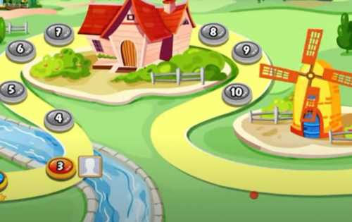

什么是维罗农场 (VERO)？ Vero Farm 是一款农场游戏，旨在让所有年龄段的玩家都能获得娱乐并获得 VERO 代币奖励。 Vero Farm 包括主要的娱乐活动，如：商业、孵化器、战斗……此外，玩家可以在 NFT Marketplace 上交易 NFT 游戏内物品或通过 How to Feature Staking、Yield Farming with Tokens、NFT 获得更多 Vero Token 奖励。
Vero Farm Metaverse 概念我们构建了一个虚拟农场世界，让来自世界各地的玩家可以通过游戏中的所有活动与完整的现实世界活动进行互动。

