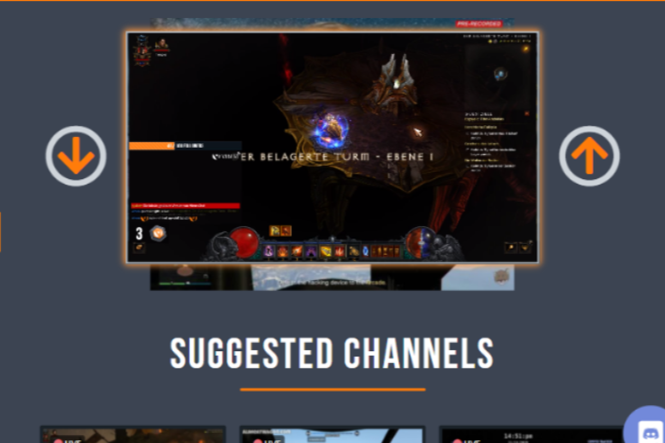

VIMM 是一个由充满激情的游戏玩家、艺人和艺术家组成的社区，他们聚集在一起创造一种独特的娱乐形式。我们为您提供建立成功渠道和发展品牌所需的工具。

  没有排他性合同。 每个主播都有一个“订阅”按钮。为您的频道保留高达 90% 的订阅收入 。使用 Hive 真正拥有您帐户的密钥！独特的排名系统，为新主播提供公平的机会！在 VIMM 上享受真正的所有权、有竞争力的收入分配和独特的推荐系统。

