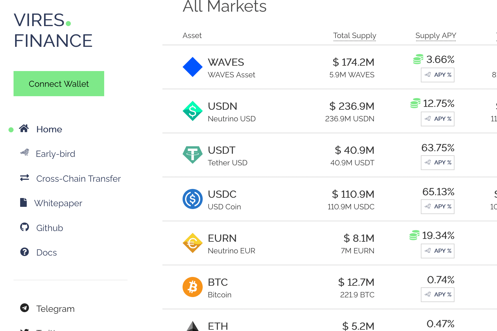

Vires.finance 是一种基于 Waves 区块链的去中心化非托管流动性协议，用户、钱包和 dapp 可以作为存款人或借款人参与其中。存款人向市场提供流动性以赚取被动收入，而借款人能够以超额抵押的方式获得贷款。
Vires.finance 使用常见的基于池的机制，其中所有存入的资金都平等地参与有息活动。借入资产的需求越大，APY 贷方获得的回报就越大。协议白皮书中描述了详细的算法。
用户可以借出和借入以下代币：WAVES、USDN、USDT、ETH、USDC、EURN和BTC。
要借入资产，首先需要提供资产作为贷款的抵押品。债务可以随时偿还，包括借款金额和应计利息。

