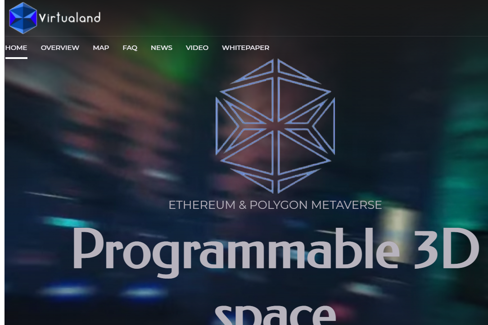

---
title: "Virtualand"
description: "🖥 可编程 3D 空间，Virtualand #Metaverse 是一个基于以下的去中心化平台：
📍 #Ethereum 和 #Polygon 网络"
date: 2022-08-21T00:00:00+08:00
lastmod: 2022-08-21T00:00:00+08:00
draft: false
authors: ["boogArno"]
featuredImage: "virtualand.png"
tags: ["NFT Games","Virtualand"]
categories: ["nfts"]
nfts: ["NFT Games"]
blockchain: "ETH"
website: "https://virtualand.technology/"
twitter: "https://twitter.com/Virtualand_tech"
discord: "https://discord.gg/3x7s7UF4d2"
telegram: "https://t.me/Virtualand_announcements"
github: ""
youtube: "https://www.youtube.com/channel/UCsb-0axHvv1eY1qgtghGlnQ"
twitch: ""
facebook: "https://www.facebook.com/Virtualand-108808245000016/"
instagram: "https://www.instagram.com/virtualand.tech/"
reddit: ""
medium: "https://medium.com/@virtualand.technology"
steam: ""
gitbook: ""
googleplay: ""
appstore: ""
status: "Live"
weight: 
lightgallery: true
toc: true
pinned: false
recommend: false
recommend1: false
---
VirtuaLands 是您可以像现实世界一样生活的地方 一般来说，您可以在这些土地上工作以赚钱、玩耍和享受乐趣，即通过 3D 和 VR 虚拟世界中的 Metaverse 体验您在现实世界中拥有的一切您可以通过 VirtuaLand 提供的区块链将您的想法应用到虚拟世界中，从而享受在新的和伟大的元界世界中工作的乐趣。Citizen Land，就是要建立一个类似于我们自己星球的地方，用户可以在这个地方购买部分虚拟空间，在这个平台的虚拟城市中实现自己的梦想。为帮助扩大项目，考虑将几块土地用于大型品牌商店、餐厅和娱乐场所。

