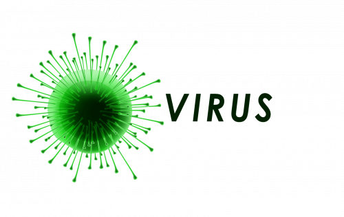

---
title: "VIRUS"
description: "$Virus 是世界上最负责任的社区模因硬币
$Virus 是一种具有超通缩销毁机制的自动生成流动性协议。"
date: 2022-08-21T00:00:00+08:00
lastmod: 2022-08-21T00:00:00+08:00
draft: false
authors: ["boogArno"]
featuredImage: "virus.png"
tags: ["Other","VIRUS"]
categories: ["nfts"]
nfts: ["Other"]
blockchain: "BSC"
website: "https://viruscoin.org/"
twitter: "https://twitter.com/virus_coin"
discord: ""
telegram: "https://t.me/viruscoin_official"
github: "https://github.com/viruscoinofficial"
youtube: ""
twitch: ""
facebook: "https://www.facebook.com/viruscoinofficial"
instagram: ""
reddit: ""
medium: "https://medium.com/@virus_coin"
steam: ""
gitbook: ""
googleplay: ""
appstore: ""
status: "Live"
weight: 
lightgallery: true
toc: true
pinned: false
recommend: false
recommend1: false
---
$Virus 是世界上最负责任的社区 meme 硬币
$Virus 是一种具有超通缩销毁机制的自动生成流动性协议。
$Virus 是一个以社区为中心的 meme 代币，可以反击诈骗和地毯。 Virus 采用最先进的代币经济学，包括反鲸鱼、反机器人、反狙击和反倾销机制来保护我们的供应。
$Virus 是一种通缩代币，旨在随着时间的推移变得更加稀缺。所有 Virus 持有者只需在您的钱包中持有 Virus 代币，即可赚取更多 Virus 并自动发送到您的钱包。当 Virus 币持有者自动从 Virus 生态系统上发生的每笔链上交易中收取 5% 的费用时，请注意您钱包中的 Virus 数量增长。社区从每笔交易产生的费用中获得更多的病毒币。

