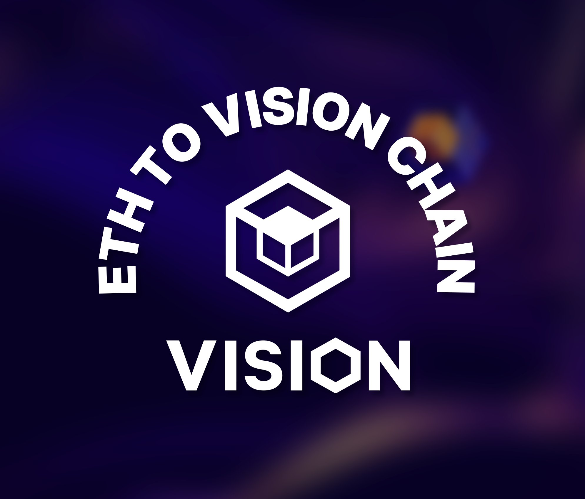

Vision是为元界打造的高性能公链。创新的 VPoS 机制和验证者节点组成了一个去中心化的 PoS 网络。凭借自主研发的元界引擎和EVM兼容特性，Vision打破虚拟与现实的界限，构建Web3.0的开放世界。快速、可扩展和高效
Vision 不仅高度重视效率和可扩展性，而且还拥有卓越的
关于 TPS 的速度。更不用说跨链兼容性了。

开发人员友好
建立在愿景之上
Vision 与 EVM 兼容，因此开发人员可以部署
他们的 dApp 就像在以太坊上一样。

