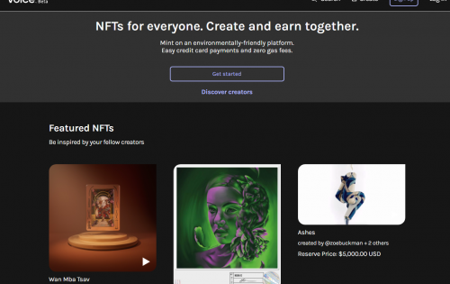

Voice 是一个 NFT 平台，可以让铸造、销售和购买数字作品变得容易。我们是一个基于 EOSIO 的美国市场，EOSIO 是最环保的区块链之一。今天，我们在 Voice 上讨论了空投的力量，并听取了艺术家们关于他们最新和即将推出的系列的看法。停下来！ 😭
我们得到了这位了不起的艺术家的报价
@shauntelewisart
 感谢您开始！ 🧡

Esperanza Parcha，代表激情。这是一种被驱动的希望，充满了火焰，它点燃了它接触到的任何人。
@VoiceHQ
 下面的链接进行投标

