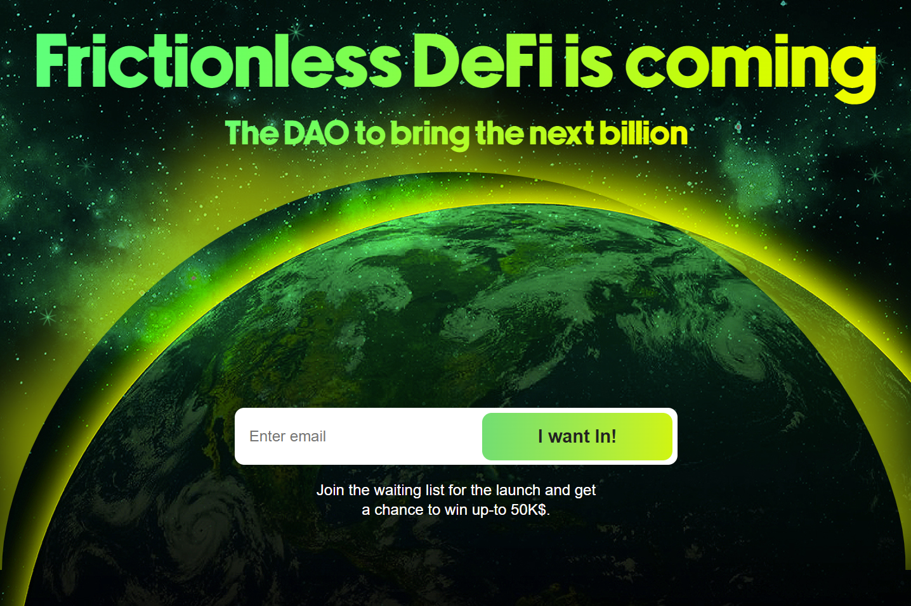

Voltage 通过对消费者友好的 Fuse Cash 移动应用程序为主流带来前所未有的 DeFi 功能。建立在强大的 Fuse 区块链和生态系统之上，Voltage 使任何人都可以随身携带 DeFi 的力量。 Voltage DAO 即将推出，同时加入我们的频道以参与并获得更新。想象一下，在获得最高利息的同时完全控制您的财务状况
迄今为止的利率。电压是一个非托管平台，带来尖端金融
工具触手可及。让我们面对现实吧，我们都希望我们的钱能进一步扩张。探索你的
在下面与我们一起获得有竞争力的收益的选项。

