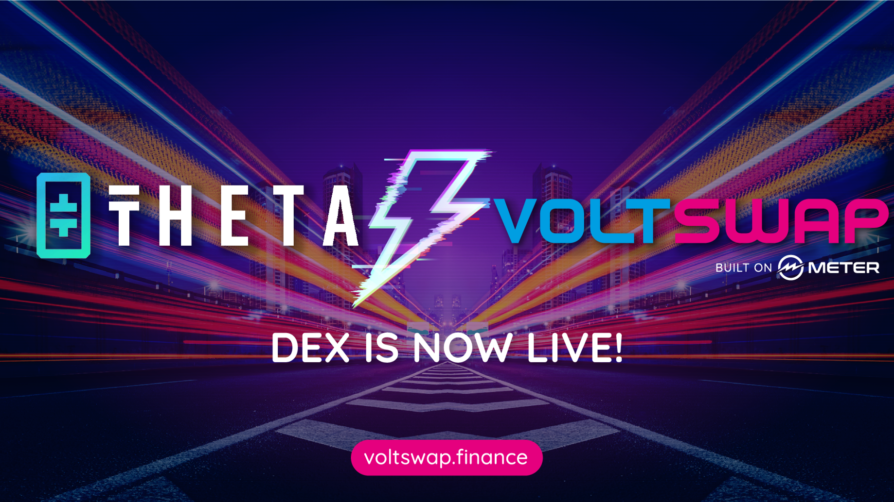

Voltswap 是一种非托管去中心化交易所 (DEX)，它允许用户通过其他用户提供的流动性进行不信任的点对点交易。VoltSwap 中的质押/流动性挖矿旨在鼓励长期行为。该池根据称为 StakingUnits 的当前奖励池的所有权份额计算用户的奖励，其定义为质押秒数 * 质押量。
主要特征：

  闪电般的交易和低gas费
  100% 抗前跑
  最大限度地挖掘流动性而不会有资金损失的风险
  没有 KYC 限制的跨链套利和入职交易所 DeFi 链。

