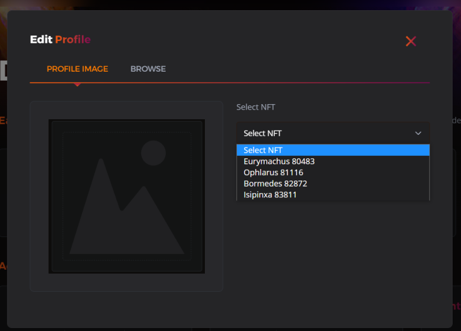

Vulcan Runner 是一款无限的“寺庙奔跑”风格的游戏，您必须在无尽的障碍赛跑中穿越您的角色。该游戏是 Frenzy Pass 系列的一部分，这意味着您可以在日常跑步中花费 $LAVA 来赚取 $LAVA。您现在可以在所有生态系统产品、游戏和市场中使用您的 Vulcan's Phalanx 作为您的头像。

只需选择您拥有的 Phalanx #NFT 并将其放置。拥有头像的唯一方法是拥有 Phalanx #NFT。...你会因此而得到回报。VulcanVerse - 一个元节，MetaScapes - 一个元节制造者，Elysium - 元界 L1 区块链，All Frenzy Games - 一个元节游戏赚取生态系统，Agora - 一个元宇宙市场。不要介意我们，因为我们将自己定位为以主导地位覆盖所有#metaverse 基地。

