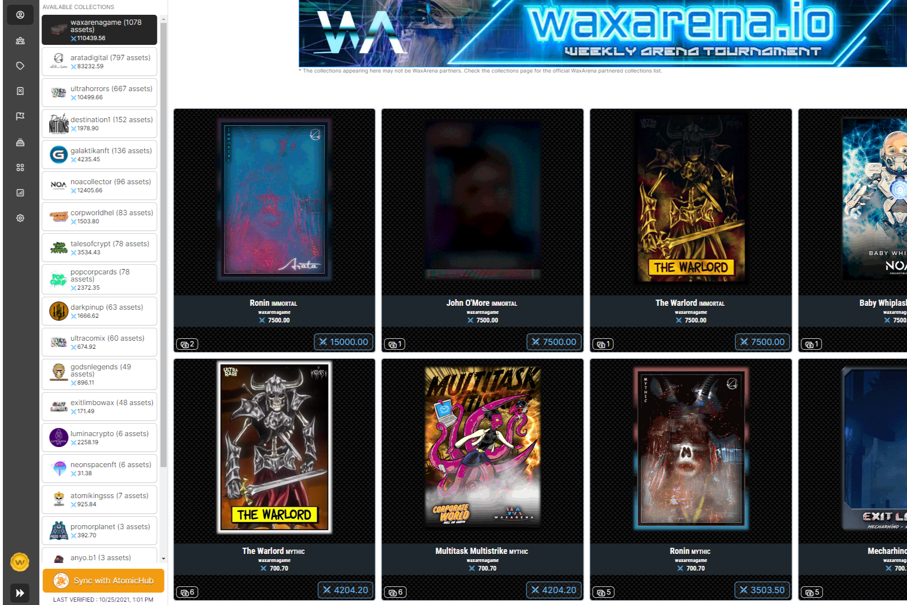

WaxArena 是一款基于网络的革命性 NFT 竞技场对战游戏，在 WAX 区块链上推出，由 Ishiki Arata、Alex Griciuc、Robert Lazar 和 Vaklin Petkov 的才华横溢的头脑创造出来。游戏的核心围绕着收集和升级 NFT，参加日常训练和竞技场战斗，最终在 WaxArena 中与其他玩家对抗，击败竞技场冠军。
玩家可以选择他们的阵容，升级他们的角色，并为这些角色配备装备以增加他们获胜的机会。 WaxArena 还专注于为 WAX 区块链上的合作 NFT 项目提供价值和实用性。这是通过使用 Power Points 奖励从这些收藏中收集和持有 NFT 的玩家来实现的。 Power Points允许玩家使用属性点自定义他们的角色。角色以竞技场体验 (AEXP) 的形式为玩家带来被动和主动收入，用于从 WAX Arena Shop 购买 NFT。
WAX Arena Shop 本身提供了许多杂项物品，可让您提高装备的稀有度、角色的等级、补充重要的统计数据以重新进入战斗等等。

